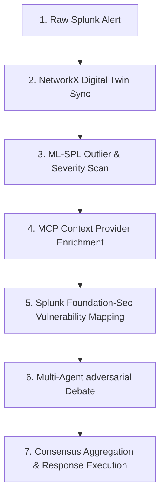

# Balancing Security and Business: How We Built "Enterprise Council AI" for the Splunk Hackathon 2026

## Executive Summary & Key Takeaways
In the fast-paced landscape of enterprise operations, security teams face a constant tug-of-war between threat containment and operational uptime. At the Splunk Hackathon 2026, we addressed this challenge head-on by building **Enterprise Council AI**—a decision-intelligence platform and developer framework that automates containment recommendations by staging multi-agent debates balanced against business-criticality models.

*   **Core Architecture:** A 7-stage consensus pipeline that ingests raw alerts, maps impact on a topological NetworkX Digital Twin, enriches context via a custom Splunk Model Context Protocol (MCP) server, and aggregates opinions from specialized LLM agents.
*   **The SecOps Dilemma:** Bridges the gap between defensive lockdowns (blocking credentials) and operational uptime (preventing multi-million dollar service disruptions).
*   **Technology Stack:** Built using Python, NetworkX, Splunk Enterprise, Model Context Protocol (MCP), Cisco Deep Time Series models, and Splunk Foundation-Sec LLMs.

---

## The 2:00 AM SecOps Dilemma

Imagine it is 2:00 AM on a Tuesday. A critical alert flashes in the Security Operations Center (SOC): a corporate user account is showing signs of potential **Privilege Escalation** and unauthorized access attempts. 

As a security analyst, your immediate, baseline instinct is to contain the threat: block the user, revoke credentials, and shut down active sessions. 

But there’s a catch. What if that user is a Senior SRE currently pushing a hotfix to patch a failing payment gateway? 

*   **Security** demands immediate containment to prevent potential data loss.
*   **Infrastructure** demands service uptime to maintain availability.
*   **Business Operations** demands protecting transaction revenue, where a minute of downtime costs thousands of dollars.
*   **Compliance** demands preserving active session logs and maintaining regulated processes.

Traditionally, resolving this conflict requires waking up multiple managers, staging high-pressure calls, and debating trade-offs with incomplete information while the clock ticks. 

We built **Enterprise Council AI** to solve this exact problem: automating the entire decision-making process by allowing domain-specific AI agents representing each business priority to debate risks, query live telemetry, and output optimal, balanced containment strategies in seconds.

---

## What is Enterprise Council AI?

**Enterprise Council AI** is a decision-intelligence platform and developer framework designed to bridge the gap between telemetry data and operational response. It transforms raw security events into balanced, context-aware containment actions through a modular **7-Stage Pipeline**:



Exposed as a single REST endpoint (`POST /api/v1/analyze`) and a developer-friendly **Python SDK**, any external SIEM, SOAR, or custom monitoring system can leverage this agentic consensus engine to coordinate safe, automated responses.

---

## Architectural Deep Dive: How It Works

### 1. Ingesting & Mapping: The Security Digital Twin
Rather than analyzing logs in isolation, Enterprise Council AI builds a topological **Digital Twin** of the organization. Using **NetworkX** in Python, the system constructs a live relationship graph from four distinct data sources:
*   **Users & Credentials** (Who has access to what?)
*   **Systems & Databases** (Where is the data stored?)
*   **Applications & Services** (Which business flows are active?)
*   **Compliance Mandates** (What regulations apply to this boundary?)

If an account is compromised, the graph immediately traces the **blast radius**. We can identify every system downstream, query node dependencies, and calculate the business criticality of the user’s department in milliseconds—far faster than querying standard relational databases.

### 2. Grounding AI with the Model Context Protocol (MCP)
To ensure our AI agents make decisions based on real telemetry rather than hallucinations, we developed a standard-compliant **Splunk MCP Server**. Exposing **30 tools** to the LLM registry, agents can:
*   Execute custom SPL searches (`splunk_run_query`)
*   Inspect active server indexes (`splunk_get_indexes`)
*   Pull system topologies and baseline statistics (`get_user_context`, `get_system_dependencies`)
*   Translate natural language into SPL queries (`saia_generate_spl`)

This lets the agents dynamically inspect the environment. If the schema changes or new source types are added, the agents adapt their queries on the fly rather than breaking due to hardcoded parsing templates.

### 3. The Adversarial Council Debate
Once an incident is classified, the platform spins up a virtual council consisting of four specialized agents:

1.  **The Security Agent**: Evaluates attack vectors using Splunk’s hosted `foundation-sec-1.1-8b-instruct` model (or a high-fidelity local fallback), mapping behaviors directly to the **MITRE ATT&CK** matrix.
2.  **The Infrastructure Agent**: Focuses on capacity limits and system dependencies, leveraging the **Cisco Deep Time Series** model to forecast database and API metrics.
3.  **The Compliance Agent**: Screens actions against regulatory standards (GDPR, SOC2, PCI-DSS) to ensure evidence preservation.
4.  **The Business Agent**: Optimizes for service uptime, financial performance, and deployment criticality.

These agents enter a structured **three-round debate**:
*   **Round 1 (Opening Statements)**: Initial risk assessments based on the raw alert telemetry.
*   **Round 2 (Cross-Examination)**: The breakthrough feature. Agents dynamically draft SPL queries, execute them via the Splunk MCP tools, and use real-time log results as evidence to challenge other agents' claims.
*   **Round 3 (Final Stances)**: Re-evaluating stances based on debate rebuttals and risk calculations.

```python
# A look at how developers can trigger this consensus loop using the Python Client SDK:
from sdk.client import CouncilClient

client = CouncilClient(api_url="https://enterprise-council-ai-58611599850.us-central1.run.app")

result = client.analyze_incident(
    user="John",
    event="Privilege Escalation",
    severity="Critical"
)

print(f"Council Recommendation: {result['decision']['decision']}")
print(f"Consensus Confidence: {result['decision']['confidence'] * 100}%")
```

### 4. Risk Math & Impact Simulation
Before the Council Agent outputs a recommendation, the **Impact Simulation Engine** simulates the consequences of three playbooks: *Block User*, *Temporary Restriction*, and *Monitor Only*. 

The final consensus score is determined using a hybrid risk formula:

$$\text{Consensus Score} = (1 - \lambda) \frac{\sum_{i=1}^{N} w_i \cdot (100 - R_i)}{N} + \lambda \cdot (100 - I_{\text{sim}})$$

Where:
*   $w_i$ is the weight of agent $i$ based on domain relevance.
*   $R_i$ is the agent's risk rating.
*   $I_{sim}$ is the simulated impact of the containment action on the digital twin.
*   $\lambda$ (lambda) is a balancing coefficient that dynamically shifts weight to the simulation model when agent opinions diverge.

---

## Production-Grade Security & Performance Hardening

Exposing AI agents to raw enterprise data requires strict safety boundaries. We engineered several security protocols:
*   **SPL Injection Prevention:** Developed strict input validation filters at the REST gateway to sanitize target users and event types before queries are generated.
*   **Destructive Command Blocking:** The MCP server parses and immediately blocks destructive SPL keywords (such as `delete`, `collect`, `outputlookup`, `run`) to guarantee query safety.
*   **Cryptographic Audit Trails:** Every decision calculates a SHA-256 integrity hash, ensuring tamper-proof audit trails for compliance reporting.
*   **Parallel Query Execution:** Implemented thread pooling to run MCP contextual lookups and agent debates in parallel, bringing total decision latency down to under 3 seconds in offline evaluation mode.

---

## The EU AI Act Compliance Factor
With global AI regulations tightening, explainability is a necessity. Enterprise Council AI is built to comply with **EU AI Act (Chapter II, Articles 9-15)** guidelines for High-Risk AI Systems:
*   **Article 9 (Risk Management):** Continuous simulation of business and security risk trade-offs.
*   **Article 13 (Transparency):** Exposes the full multi-round debate transcript detailing the reasoning, SPL evidence, and voting results.
*   **Article 14 (Human Oversight):** Allows operators to review details, select alternate actions, and approve SOAR execution via the Command Center.
*   **Article 11 & 12 (Record Keeping):** In one click, users can download a complete PDF conformity report containing the debate timeline, audit signatures, and compliance hashes.

---

## What's Next?
We are looking forward to expanding the scope of Enterprise Council AI:
1.  **Active SOAR Integrations:** Transitioning from simulated dispatches to active directory blocking (e.g. triggering real Okta suspensions or ServiceNow incident tickets).
2.  **Multi-LLM Benchmarking:** Running debates across different model backends (Claude, Gemini, local Llama instances) to measure differences in decision quality and balance.
3.  **Lateral Movement GNNs:** Training graph neural networks directly on the NetworkX Digital Twin to anticipate hacker paths before they appear in active security logs.

---

## Try It Yourself!

*   **Live Web App (Firebase):** [https://enterprise-council-ai.web.app](https://enterprise-council-ai.web.app)
*   **Operational Command Center (Cloud Run):** [https://enterprise-council-ai-58611599850.us-central1.run.app](https://enterprise-council-ai-58611599850.us-central1.run.app)
*   **GitHub Repository:** [https://github.com/anishanandhan/Enterprise-council](https://github.com/anishanandhan/Enterprise-council)
